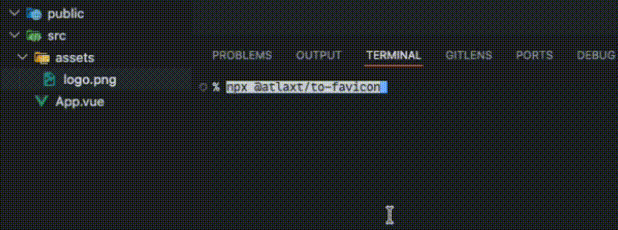

# @atlaxt/to-favicon

Convert any image — or a URL — into ready-to-use favicon files with a single command.

```bash
npx @atlaxt/to-favicon <image>
npx @atlaxt/to-favicon <url>
```



## Output

Every run produces three files:

| File | Size | Use |
|---|---|---|
| `favicon.ico` | 16 × 16, 32 × 32, 48 × 48 | Browsers, bookmarks |
| `favicon.png` | 32 × 32 | Modern browsers |
| `apple-touch-icon.png` | 180 × 180 | iOS home screen |

Files are saved to `public/` if the folder exists, otherwise to the current directory.

## Usage

**From a local file**
```bash
npx @atlaxt/to-favicon logo.png
npx @atlaxt/to-favicon ./assets/icon.svg
```

**From a URL** — fetches the site's existing favicon and converts it
```bash
npx @atlaxt/to-favicon https://example.com
```

**Interactive** — run without arguments and enter the path or drag the file
```bash
npx @atlaxt/to-favicon
```

## Supported formats

PNG, JPEG, WebP, AVIF, TIFF, GIF, SVG
